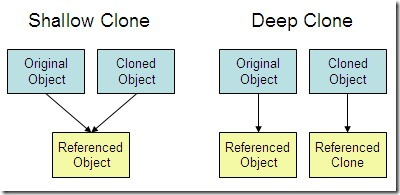

C, C++ &amp; OOPS for Interviews 

# Features of OOP

- **Abstraction**
We try to obtain abstract view, model or structure of real life problem, and
reduce its unnecessary details. With definition of properties of problems,
including the data which are affected and the operations which are identified,
the model abstracted from problems can be a standard solution to this type of
problems. It is an efficient way since there are nebulous real-life problems that
have similar properties.

- **Encapsulation**
Encapsulation is the process of combining data and functions into a single unit
called class. In Encapsulation, the data is not accessed directly; it is accessed
through the functions present inside the class. In simpler words, attributes of
the class are kept private and public getter and setter methods are provided to
manipulate these attributes. Thus, encapsulation makes the concept of data hiding
possible. (Data hiding: a language feature to restrict access to members of an
object, reducing the negative effect due to dependencies. e.g. "protected",
"private" feature in C++).

- **Inheritance**
The idea of inheritance is simple, a class is based on another class and uses
data and implementation of the other class. And the purpose of inheritance is
Code Reuse.

- **Polymorphism**
Polymorphism is the ability to present the same interface for differing underlying
forms (data types). With polymorphism, each of these classes will have different
underlying data. A point shape needs only two coordinates (assuming it's in a
two-dimensional space of course). A circle needs a center and radius. A square
or rectangle needs two coordinates for the top left and bottom right corners and
(possibly) a rotation. An irregular polygon needs a series of lines.

# Smart Pointers

Pointers with `*` and `->` overloaded. Using
[smart pointers](http://en.wikipedia.org/wiki/Smart_pointer), we can make
pointers to work in way that we don’t need to explicitly call delete.
[Smart pointer](http://en.wikipedia.org/wiki/Smart_pointer) is a wrapper class
over a pointer with operator like `*` and `->` overloaded. The objects of smart
pointer class look like pointer, but can do many things that a normal pointer
can’t like automatic destruction (yes, we don’t have to explicitly use delete),
reference counting and more.

The idea is to make a class with a pointer, destructor and overloaded operators
like `* `and `->`. Since *destructor is automatically called when an object goes
out of scope*, the dynamically allocated memory would automatically be deleted
(or reference count can be decremented). Consider the following simple `smartPtr`
class.


```cpp
#include<iostream>
using namespace std;

class SmartPtr {
    int *ptr; // Actual pointer
public:
    explicit SmartPtr(int *p = NULL) { ptr = p; }

    ~SmartPtr() {
        delete(ptr);
    }

    // Overloading dereferencing operator
    int &operator *() {
        return *ptr;
    }
};

int main() {
    SmartPtr ptr(new int());
    *ptr = 20;
    cout << *ptr;
    return 0;
}
```


Examples: `unique_ptr`, `shared_ptr`

# Name Mangling and Externs

[https://www.geeksforgeeks.org/extern-c-in-c/](https://www.geeksforgeeks.org/extern-c-in-c/) 

In C++, C function names may not be mangled, as C does not have function overloading feature.


```cpp
int printf(char *format, ...);

int main() {
    printf("Hello, world!");
    return 0;
}
```


Gives - 


```cpp
undefined reference to `printf(char const*, ...)'
        ld returned 1 exit status
```


Use `extern C` for C codes.

```cpp
extern "C" {
    int printf(char *format, ...);
}
int main() {
    printf("Hello, world!");
    return 0;
}
```

# Virtual Functions

_Constructor can never be a virtual function._

[https://ideone.com/cmt0E3](https://ideone.com/cmt0E3) 


```cpp
#include <iostream>
using namespace std;

class Base {
public:
    void show() {
        cout << "Base\n";
    }
};

class Derv1: public Base {
public:
    void show() {
        cout << "Derv1\n";
    }
};


class Derv2: public Base {
public:
    void show() {
        cout << "Derv2\n";
    }
};

int main() {
    Derv1 derv1;
    Derv2 derv2;
    Base *ptr;
    ptr = &derv1;
    ptr -> show();
    ptr = &derv2;
    ptr -> show();
    return 0;
}
```


Output:

```
Base
Base
```

This is known as **Static/Early Binding**. Depends on the _type_ of ptr, not _content_.

Compile-time/Static polymorphism → Function overloading (this one), Operator overloading

[https://ideone.com/8eDA0X](https://ideone.com/8eDA0X)


```cpp
#include <iostream>
using namespace std;

class Base {
public:
    virtual void show() {
        cout << "Base\n";
    }
};

class Derv1: public Base {
public:
    // not necessary to add `virtual` keyword, as the function of the base is
    // virtual
    void show() {
        cout << "Derv1\n";
    }
};


class Derv2: public Base {
public:
    void show() {
        cout << "Derv2\n";
    }
};

int main() {
    Derv1 derv1;
    Derv2 derv2;
    Base *ptr;
    ptr = &derv1;
    ptr -> show();
    ptr = &derv2;
    ptr -> show();
    return 0;
}
```


Output:

```
Derv1
Derv2
```

Prepend `virtual` keyword to the function definition → virtual function.

The rule is that the compiler selects the function based on the contents of `ptr`, 
not type. Type is used in *non-virtual* case.

Here the compiler does not know what class the contents of `ptr` may contain. It 
may content address of an object of the `Derv1` class or of the `Derv2` class. At 
runtime, this is decided on the basis of content. When it is known what class is 
pointed to by `ptr`, the appropriate version is called. This is known as **Late 
Binding**.

## Pure Virtual Functions

Another usage for virtual functions is when we cannot, or we don’t want to
implement a method for parent class.


```cpp
#include <iostream>
using namespace std;

class Base {
public:
    virtual void show() = 0; // pure virtual function
};

class Derv1: public Base {
public:
    void show() {
        cout << "Derv1\n";
    }
};


class Derv2: public Base {
public:
    void show() {
        cout << "Derv2\n";
    }
};

int main() {
    Derv1 derv1;
    Derv2 derv2;
    Base *ptr;
    ptr = &derv1;
    ptr -> show();
    ptr = &derv2;
    ptr -> show();
    return 0;
}
```


Output:

```
Derv1
Derv2
```

The class Base is now an abstract class and cannot be instantiated. Any class with 
a pure virtual function is an abstract class. Once you’ve placed a pure virtual 
function in the base class, you must override it in all the derived classes from 
which you want to instantiate objects. **If a class doesn’t override the pure 
virtual function, it becomes an abstract class itself**, and you can’t instantiate 
objects from it (although you might from classes derived from it). For consistency, 
you may want to make all the virtual functions in the base class pure.

**Abstract classes** are also called **interfaces** in C++.

A Good Example of Late Binding:

```cpp
#include <iostream>
using namespace std;

class Department {
public:
    void show() {
        cout << "You are in CS dept\n";
    }
    virtual void getData() = 0;
};

class Professor: public Department {
public:
    void getData() {
        Department::show();
        cout << "You are in Professor section\n";
    }
};

class Student: public Department {
public:
    void getData() {
        Department::show();
        cout << "You are in Students section\n";
    }
};


int main() {
    string s;
    cin >> s;
    Department *dept;
    Student student;
    if (s == "S") {
        // same as: Department *dept = new Student();
        // dept = &student;
        dept = new Student();
    } else {
        dept = new Professor();
    }
    dept -> getData();
    return 0;
}
```

## Virtual Destructors

```cpp
#include <iostream>
using namespace std;

class Base {
public:
    void show() {
        cout << "Base\n";
    }
    virtual ~Base() {
        cout << "Base destroyed\n";
    }
};

class Derv: public Base {
public:
    void show() {
        cout << "Derv\n";
    }
    ~Derv() {
        cout << "Derv destroyed\n";
    }
};

int main() {
    Base *pBase = new Derv();
    delete pBase;
}
```

Deletes both Base and Derv. If not virtual, only “Base” will be deleted.

## Virtual Table

Source: https://www.learncpp.com/cpp-tutorial/125-the-virtual-table/ 

To implement virtual functions, C++ uses a special form of late binding known as 
the virtual table. The virtual table is a lookup table of functions used to resolve 
function calls in a dynamic/late binding manner. The virtual table sometimes goes 
by other names, such as “vtable”, “virtual function table”, “virtual method table”,
or “dispatch table”.

First, every class that uses virtual functions (or is derived from a class that
uses virtual functions) is given its own virtual table. This table is simply a 
static array that the compiler sets up at compile time. A virtual table
contains one entry for each virtual function that can be called by objects of the
class. Each entry in this table is simply a function pointer that points to the 
most-derived function accessible by that class.

Second, the compiler also adds a hidden pointer to the base class, which we will call *__vptr.
*__vptr is set (automatically) when a class instance is created so that it points to the virtual
table for that class. Unlike the *this pointer, which is actually a function parameter used by the
compiler to resolve self-references, *__vptr is a real pointer. Consequently, it makes each class
object allocated bigger by the size of one pointer. It also means that *__vptr is inherited by derived
classes, which is important.

```cpp
class Base {
public:
    virtual void function1() {};
    virtual void function2() {};
};
 
class D1: public Base {
public:
    virtual void function1() {};
};
 
class D2: public Base {
public:
    virtual void function2() {};
};
```

Because there are 3 classes here, the compiler will set up 3 virtual tables: one
for Base, one for D1, and one for D2.

The compiler also adds a hidden pointer to the most base class that uses virtual
functions. Compiler does this automatically.

```cpp
class Base {
public:
    FunctionPointer *__vptr;
    virtual void function1() {};
    virtual void function2() {};
};
 
class D1: public Base {
public:
    virtual void function1() {};
};
 
class D2: public Base {
public:
    virtual void function2() {};
};
```

When a class object is created, `*__vptr` is set to point to the virtual table for
that class. For example, when an object of type Base is created, `*__vptr` is set to 
point to the virtual table for Base. When objects of type D1 or D2 are constructed,
`*__vptr` is set to point to the virtual table for D1 or D2 respectively.

Now, let’s talk about how these virtual tables are filled out. Because there are only two virtual
functions here, each virtual table will have two entries (one for function1(), and one for function2()).
Remember that when these virtual tables are filled out, each entry is filled out with the most-derived
function an object of that class type can call.

The virtual table for Base objects is simple. An object of type Base can only access the members of Base.
Base has no access to D1 or D2 functions. Consequently, the entry for function1 points to Base::function1(),
and the entry for function2 points to Base::function2().

The virtual table for D1 is slightly more complex. An object of type D1 can access members of both D1 and Base.
However, D1 has overridden function1(), making D1::function1() more derived than Base::function1().
Consequently, the entry for function1 points to D1::function1(). D1 hasn’t overridden function2(),
so the entry for function2 will point to Base::function2().

The virtual table for D2 is similar to D1, except the entry for function1 points to Base::function1(),
and the entry for function2 points to D2::function2().


The *__vptr in each class points to the virtual table for that class. The entries in the virtual table point
to the most-derived version of the function objects of that class are allowed to call.


# Virtual Base Class


```
    Parent
   /       \
Child1        Child2
  \        /
 Grandchild
```

_The Diamond problem_

If an inherited method from Parent is called from Grandchild, will throw ambiguous error.

```cpp
# include <iostream>
using namespace std;

class Parent {
protected:
    static int basedata;
};

int Parent::basedata = 5;

class Child1 : virtual public Parent { // shares copy of Parent
};

class Child2 : virtual public Parent { // shares copy of Parent
};

class Grandchild : public Child1, public Child2 {
public:
    int getdata() {
        return basedata; // no longer ambiguous
    }
};


int main() {
    Grandchild *gc = new Grandchild();
    cout << gc -> getdata() << "\n";
    return 0;
}
```


The use of the keyword virtual in these two classes causes them to share a single
common subobject of their base class Parent. Since there is only one copy of
basedata, there is no ambiguity when it is referred to in Grandchild. The need
for virtual base classes may indicate a conceptual problem with your use of
multiple inheritance, so they should be used with caution.

# Friend Functions

Accessing private or protected data.

## Friends as Bridges

Acts as bridges between two classes.


```cpp
# include <iostream>
using namespace std;

class Beta;

class Alpha {
private:
    int data;
public:
    Alpha(): data(3) { };
    friend int friendFunction(Alpha, Beta);
};

class Beta {
private:
    int data;
public:
    Beta(): data(7) { };
    friend int friendFunction(Alpha, Beta);
};


int friendFunction(Alpha alpha, Beta beta) {
    return alpha.data + beta.data;
}

int main() {
    Alpha alpha;
    Beta beta;
    cout << friendFunction(alpha, beta) << "\n"; // outputs 10
    return 0;
}
```


Note the declaration, they can go anywhere (private, protected) not necessarily
in public.

# Friend Classes


```cpp
# include <iostream>
using namespace std;


class Alpha {
private:
    int data;
public:
    Alpha(): data(3) { };
    friend class Beta;
};

class Beta { // can access all private of Alpha
public:
    void func1(Alpha alpha) {
        cout << alpha.data << "\n";
    }
};


int main() {
    Alpha alpha;
    Beta beta;
    beta.func1(alpha);
    return 0;
}
```


## Private constructors using Friend Classes


```cpp
#include <iostream>
using namespace std;

class A {
private:
    A() {
        cout << "constructor of A\n";
    }
    friend class B;
};

// class B, friend of class A
class B {
public:
    B() {
        A a1;
        cout << "constructor of B\n";
    }
};

int main(){
    B b1;
    return 0;
}
```


Outputs:

```
constructor of A
constructor of B
```

However, if we try to instantiate A, we will get error:
`_main.cpp:25:7: error: ‘A::A()’ is private within this context`.

# Static Functions

```cpp
# include <iostream>
using namespace std;


class Gamma {
private:
    static int total;
    int id;
public:
    Gamma() {
        ++ total;
        id = total;
    }
    ~ Gamma() {
        -- total;
        cout << "Destroying id number " << id << "\n";
    }
    static void showTotal() {
        cout << "Total is " << total << "\n";
    }
    void showid() {
        cout << "ID is " << id << "\n";
    }
};


int Gamma::total = 0;

int main() {
    Gamma g1, g2;
    Gamma::showTotal(); // without static won't work; i.e., static void showTotal() will work
                        // but void showTotal() won't
    Gamma g3;
    Gamma::showTotal();
    g1.showid();
    g2.showid();
    g3.showid();
    cout << "End of Program\n";
    return 0;
}
```

Outputs:

```
Total is 2
Total is 3
ID is 1
ID is 2
ID is 3
End of Program
Destroying id number 3
Destroying id number 2
Destroying is number 1
```


Note the order of destructions. Clearly shows the LIFO stack underneath.

**Can Static Functions be Virtual?** No.

## Private Constructor using Static Function

Since a static function can be called without instantiating the object, it can be
used to instantiate an object having a private constructor.

```cpp
#include <iostream>
using namespace std;

class Alpha {
private:
    Alpha() {
        cout << "Constructor of Alpha" << endl;
    }
public:
    static Alpha* getObject() {
        return new Alpha();
    }
    void whoAmI() {
        cout << "I am Alpha" << endl;
    }
};


int main() {
    Alpha *alpha = Alpha::getObject();
    alpha -> whoAmI();
    return 0;
}
```

Outputs:

```
Constructor of Alpha
I am Alpha
```

# Copy Constructors

```cpp
#include<iostream>
using namespace std;

class Point {
private:
    int x, y;
public:
    Point(int x1, int y1) {
        x = x1; y = y1;
    }

    // Copy constructor
    Point(const Point &p2) {
        x = p2.x;
        y = p2.y;
    }

    int getX() {
        return x;
    }
    int getY() {
        return y;
    }
};

int main() {
    Point p1(10, 15); // Normal constructor is called here
    Point p2 = p1; // Copy constructor is called here
    Point p3(p1); // Copy constructor, different syntax

    // Let us access values assigned by constructors
    cout << "p1.x = " << p1.getX() << ", p1.y = " << p1.getY();
    cout << "\np2.x = " << p2.getX() << ", p2.y = " << p2.getY();
    cout << "\np3.x = " << p3.getX() << ", p3.y = " << p3.getY();

    return 0;
}
```


C++ provides default copy constructors to all classes.

# Shallow Copy and Deep Copy

Default copy constructor only does shallow copy, i.e., a member by member copy.



```cpp
#include <bits/stdc++.h>

class MyString {
private:
    char *m_data{};
    int m_length{};
 
public:
    MyString(const char *source="") {
        assert(source);
        m_length = std::strlen(source) + 1;

        m_data = new char[m_length];

        for (int i = 0; i < m_length; ++i)
            m_data[i] = source[i];
    
        // Make sure the string is terminated
        m_data[m_length - 1] = '\0';
    }
 
    ~MyString() {
        delete[] m_data;
    }

    char* getString() { return m_data; }
};


int main() {
    MyString hello{ "Hello, world!" };
    {
        MyString copy{ hello }; // use default copy constructor
   
    } // copy is a local variable, so it gets destroyed here.  The destructor deletes copy's string, which leaves hello with a dangling pointer
    std::cout << hello.getString() << '\n'; // this will have undefined behavior if we don't use deep copy
    return 0;
}
```

The above example shows the issue with shallow copy. Let's use deep copy to fix
it:

```cpp
#include <bits/stdc++.h>

class MyString {
private:
    char *m_data{};
    int m_length{};
 
public:
    MyString(const char *source="") {
        assert(source);
        m_length = std::strlen(source) + 1;

        m_data = new char[m_length];

        for (int i = 0; i < m_length; ++i)
            m_data[i] = source[i];
    
        // Make sure the string is terminated
        m_data[m_length - 1] = '\0';
    }
 
    ~MyString() {
        delete[] m_data;
    }
 
    char* getString() { return m_data; }
    int getLength() { return m_length; }
    
    void deepCopy(const MyString &source) {
        delete[] m_data;
        m_length = source.m_length;
        
        if (source.m_data) {
            m_data = new char[m_length];
            for (int i = 0; i < m_length; ++i) {
                m_data[i] = source.m_data[i];
            }
        } else {
            m_data = nullptr;
        }
    }
    
    MyString(const MyString &source) {
        deepCopy(source);
    }
};


int main() {
    MyString hello{ "Hello, world!" };
    {
        MyString copy{ hello }; // use default copy constructor
    }
    // copy is a local variable, so it gets destroyed here. The destructor deletes copy's string, since we
    // have used deep copy, hello will have it's own copy of the string
    std::cout << hello.getString() << '\n'; // no longer undefined behavior
    return 0;
}
```

# Operator Overloading

```cpp
# include <iostream>
using namespace std;

class Counter {
private:
    unsigned int count;
public:
    Counter(): count(0) {}
    unsigned int getCount() {
        return count;
    }
    void operator ++ () {
        ++count;
    }
};

int main() {
    Counter c1, c2, c3;
    ++ c1;
    cout << c1.getCount() << "\n"; // 1
    ++ c2;
    cout << c2.getCount() << "\n"; // 1
    cout << c3.getCount() << "\n"; // 0
}
```


Note the return value of the operator method. If we try c4 = ++ c1, compiler will
complain since the operator is not returning anything. In order to do that:


```cpp
Counter operator ++ () {  // increment count
    ++count;  //increment count
    Counter temp;  // make a temporary Counter
    temp.count = count;   // give it same value as this obj
    return temp;          //return the copy
}
```


Another elegant way to do this is using nameless temporary object.


```cpp
Counter operator ++ (int) {
    return Counter(count++);
}
```

## Arithmetic Operators


```cpp
Distance Distance::operator + (Distance d2) const {
    int f = feet + d2.feet;
    float i = inches + d2.inches;
    if (i >= 12.0) {
        i -= 12.0;
        f++;
    }
    return Distance(f, i);
}

```

# Namespace

```cpp
# include <iostream>
using namespace std;

int value = 10;

namespace first {
    int value = 40;
    namespace second {
        int value = 20;
    }
}

int main() {
    int value = 30;
    cout << value << "\n"; // 30
    cout << first::value << "\n"; // 40
    cout << first::second::value << "\n"; // 20
    cout << ::value << "\n"; // 10
    return 0;
}
```


One can do namespace aliasing by: `namespace alias = first::second::`.

Can also use `using` keyword: using namespace first.

Unnamed Namespace:


```cpp
# include <iostream>
using namespace std;

int value = 10;

namespace {
    int val = 5;    
}

// namespace {
//     int val = 6;
// } if included, will throw compilation error

int main() {
    cout << val << "\n"; // prints 5
    return 0;
}
```


The namespace name is uniquely generated by the compiler.

# Templates

Templates make it possible to handle different data types by a single function or
class.

## Function Templates

```cpp
#include <iostream>
using namespace std;

template <class T>
T abs (T n) {
    return n < 0 ? -n : n;
}

int main() {
    cout << abs(5) << "\n";
    cout << abs(-5.2) << "\n";
    return 0;
}
```

_More Than One Template Argument_

```cpp
#include <iostream>
#include <vector>
using namespace std;

template <class atype, class btype>
atype find_ (vector<atype> a, btype n, atype k) {
    for (btype i = 0; i < n; ++i) {
        if (a[i] == k) {
            return i;
        }
    }
    return static_cast<atype>(-1);
    // return -1;
}

int main() {
    cout << find_({-1.0, 2.1, 3.0}, 3, 2.1) << "\n";
    return 0;
}
```

## Class Templates


```cpp
#include <iostream>
using namespace std;

template <class Type>
class Stack {
private:
    Type st[100];
    int top;
public:
    Stack() {
        top = -1;
    }
    void push(Type var) {
        st[++top] = var;
    }
    Type pop() {
        return st[top--];
    }
};


int main() {
    Stack <float> s;
    s.push(123.2);
    s.push(236.78);
    s.push(6553.1);
    cout << s.pop() << "\n";
    cout << s.pop() << "\n";
    cout << s.pop() << "\n";
    return 0;
}
```


# Exceptions

Systematic, object-oriented way to handle errors generated by C++ errors.


```cpp
#include <iostream>
using namespace std;

const int MAX = 3;

class Stack {
private:
    int st[MAX];
    int top;
public:
    class Full {
        
    };
    class Empty {
        
    };
    Stack() {
        top = -1;
    }
    void push(int var) {
        if (top >= MAX - 1) {
            throw Full();
        }
        st[++top] = var;
    }
    int pop() {
        if (top < 0) {
            throw Empty();
        }
        return st[top--];
    }
};


int main() {
    Stack s;
    try {
        s.push(123);
        s.push(236);
        s.push(6553);
        s.push(23);
        cout << s.pop() << "\n";
        cout << s.pop() << "\n";
        cout << s.pop() << "\n";
        cout << s.pop() << "\n";
    } catch(Stack::Full) {
        cout << "Exception: Stack Full!\n";
    } catch (Stack::Empty) {
        cout << "Exception: Stack Empty!\n";
    }
    return 0;
}
```

We can also define exception classes.

```cpp
#include <iostream>
using namespace std;

class Dist {
private:
    int feet;
    float inches;
public:
    class InchesEx {
        public:
            string origin;
            float iValue;
            
        InchesEx(string org, float in) {
            origin = org;
            iValue = in; 
        }
    };
    
    
    Dist(int ft, float inc) {
        if (inc >= 12.0) {
            throw InchesEx("2 arg constructor", inc);
        }
        feet = ft;
        inches = inc;
    }
 
    void getDist() {
        cout << "Enter feet:";
        cin >> feet;
        cout << "Enter inches";
        cin >> inches;
        if (inches >= 12.0) {
            throw InchesEx("getDist function", inches);
        }
    }  
};


int main() {
    try {
        Dist d(5, 13);
    } catch (Dist::InchesEx ix) {
        cout << "Error!\n" << ix.origin << "\nInches: " << ix.iValue <<"\n";
    }
    return 0;
}
```

Built-in exception classes: `bad_alloc` is one example. There are many others in STL.

# free vs delete()

In C++, delete operator should only be used either for the pointers pointing to the memory allocated using new operator or for a NULL pointer, and free() should only be used either for the pointers pointing to the memory allocated using malloc() or for a NULL pointer.

# C Storage Classes

- **auto**: default, they can only be accessed within the block/function they have been declared and not outside them (which defines their scope).

- **extern**: This storage class tells that the variable is defined elsewhere and not within the same block where it is used.

- **static**: They have the property of preserving their value even after they are out of their scope.

- **register**: Uses CPU register.

|Storage Specifier | Storage | Initial Value | Scope | Life |
|------------------|---------|---------------|-------|------|
| auto | Stack | Garbage | Within block | End of block |
| extern | Data Segment | Zero | global multiple files | Till end of program |
| static | Data Segment | Zero | Within block | Till end of program | 
| register | CPU Register | Garbage | Within block | End of block |

# C Storage Layout


<small>[Source](https://media.geeksforgeeks.org/wp-content/uploads/memoryLayoutC.jpg)</small>

**Heap**: dynamic memory allocation

**Stack**: function calls, local variables

**Uninitialized data (bss)**: BSS = **B**lock **S**tarted by **S**ymbol; all uninitialized global and static variable

**Initialized data (ds)**: DS = **D**ata **S**egment; explicitly initialized global and static variables

**Text**: binary of the compiled program, read-only; sharable so that only a
single copy needs to be in memory for frequently executed programs such as text editors etc

# Credits

Portions of this note is taken from geeksforgeeks, LeetCode, learncpp website,
Cracking the Coding Interview, and Object-Oriented Programming in C++, Fourth
Edition book.
