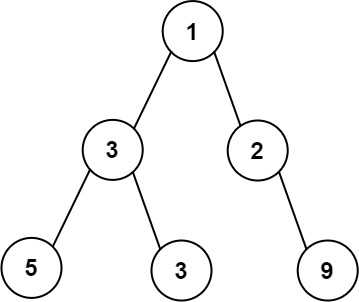
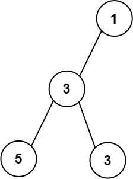
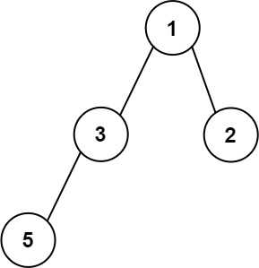

<!-- Problem Statement -->

Given the root of a binary tree, return the maximum width of the given tree.

The maximum width of a tree is the maximum width among all levels.

The width of one level is defined as the length between the end-nodes (the leftmost
and rightmost non-null nodes), where the null nodes between the end-nodes are also
counted into the length calculation.

It is guaranteed that the answer will in the range of 32-bit signed integer.

***Example 1***



- **Input**:  root = [1,3,2,5,3,null,9] 
- **Output**:  4
- **Explanation**: The maximum width existing in the third level with the length 4 (5,3,null,9).

***Example 2***



- **Input**: root = [1,3,null,5,3]
- **Output**: 2
- **Explanation**: The maximum width existing in the third level with the length 2 (5,3).

***Example 3***



- **Input**: root = [1,3,2,5]
- **Output**: 2
- **Explanation**: The maximum width existing in the second level with the length 2 (3,2).


## Approach 1: Breadth First Search (BFS)

### Idea

BFS visits the tree level by level. Thus, by modifying the BFS code we can find the
width of each level of the binary tree.

We know that a binary tree can be represented by an array (assuming the root begins
from the position with index 1 in the array). If the index of a node is i, the
indices of its left and right children are 2i and 2i + 1 respectively.

Here's how it looks:

```text
                1
          2               3
      4       5       6       7
    8   9   # 11    12 #     # 15
```

`#` represents a null node.


### Implementation

```cpp
int widthOfBinaryTree(TreeNode* root) {
    if (!root) return 0;
    long maximumWidth = 0;
    // Node, index in array
    queue<pair<TreeNode*, long>> q;
    q.push({root, 1L});
    while (!q.empty()) {
        maximumWidth = max(maximumWidth, q.back().second + 1L - q.front().second);
        int n = q.size();
        while (n--) {
            TreeNode* node = q.front().first;
            int position = q.front().second;
            q.pop();
            if (node->left) {
                q.push({node->left, position * 2L});
            }
            if (node->right) {
                q.push({node->right, position * 2L + 1L});
            }
        }
    }
    return (int)maximumWidth;
}
```

### Complexity Analysis

- **Time Complexity**: O(N) where N = number of nodes in the binary tree
- **Space Complexity**: O(N), at the worst case of skewed tree we will need
  to store all the nodes in the queue

# Approach 2: Depth First Search

## Idea

We can use the similar technique we have used for BFS here as well. We keep record
of the positions in the `depthToPosition` array and use it to calculate the width.

## Implementation

```cpp
int dfs(TreeNode *root, int depth, unsigned long long position, vector<pair<unsigned long long, unsigned long long>> &depthToPosition){
    if(root == nullptr) return 0;
    if(depthToPosition.size() == depth){
        depthToPosition.push_back({position, position});
    } else {
        depthToPosition[depth].second = position;
    }
    int cur = depthToPosition[depth].second - depthToPosition[depth].first + 1;
    int left = dfs(root -> left, depth + 1, 2ULL * position, depthToPosition);
    int right = dfs(root -> right, depth + 1, 2ULL * position + 1ULL, depthToPosition);
    return max({cur, left, right});
}
    
int widthOfBinaryTree(TreeNode* root) {
    // records position for start and end of a level respectively
    vector<pair<unsigned long long, unsigned long long>> depthToPosition;
    return dfs(root, 0, 1ULL, depthToPosition);
}
```

- **Time Complexity**: O(N) where N = number of nodes in the binary tree
- **Space Complexity**: O(N), at the worst case of skewed tree we will need
  to store the details of all the nodes in the recursion stack
